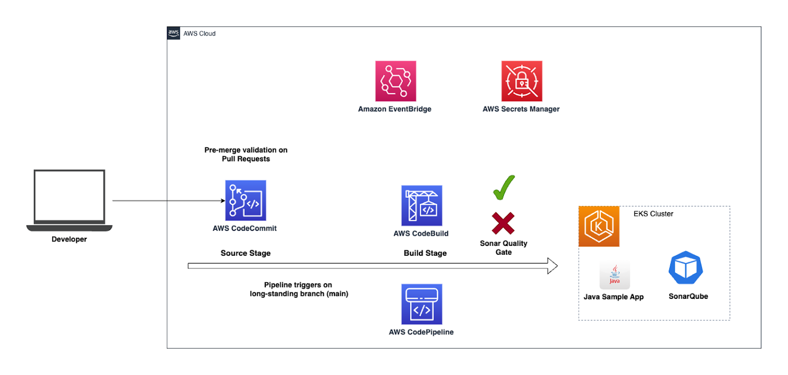

# Introcution

## Scenario

To improve the software development lifecycle (SDLC) of your team, you came up with the following plan:

1. **Existing Java app**: Your team has an existing Java app, they currently deploy manually and which has some code quality issues. They use a [Git repository](https://github.com/SonarSource-Demos/sonar-aws-java-app) for version control.
2. **Infrastructure: Amazon EKS** You will initiate a new EKS cluster in which to run your Java app.
3. **Clean Code: SonarQube automation** You have decided that ongoing code analysis is important to improve the quality of the application. For this purpose you will deploy [SonarQube](https://www.sonarsource.com/products/sonarqube/) into the AWS EKS cluster.
4. **Introduce a CI/CD pipeline**: Your team currently deploys the Java application manually. You want to introduce a fully automated process that triggers tests and code analysis and you want your team to start using feature branches with [Pull Requests](https://docs.aws.amazon.com/codecommit/latest/userguide/pull-requests.html). You will leverage [AWS CodeCommit](https://aws.amazon.com/codecommit/) as a source code repository, AWS CodeBuild for a fully managed build and test environment and [AWS CodePipeline](https://aws.amazon.com/codepipeline/) to automate the build process.
5. **Leverage SonarQube's Pull Request analysis**: You want your team to benefit from short feedback cycles. This means you want code analysis to be triggered not only when the team merges into `main` but also on every Pull Request. For this purpose you will deploy the *AWS Sonar Plugin* which enables triggering SonarQube's Pull Request with AWS CodeBuild projects.
6. **Improve the Java application**: With a fully automated CI/CD pipeline and code analysis tooling in place, you will improve the quality of the code and ultimately deploy the improved Java application to the Kubernetes cluster.

[Previous](../README.md) | [Next](../2.CleanCode/README.md)
