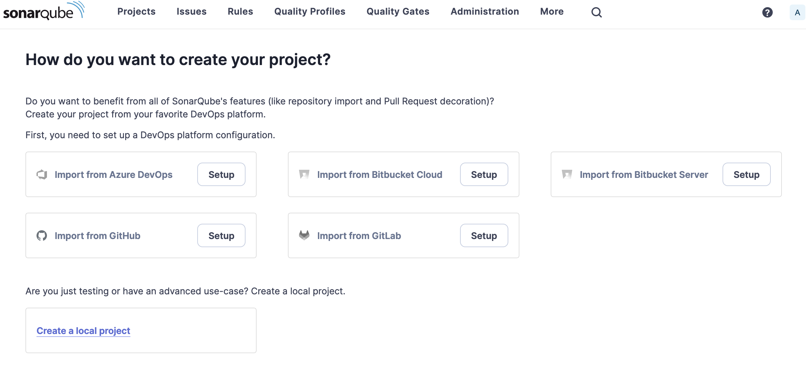
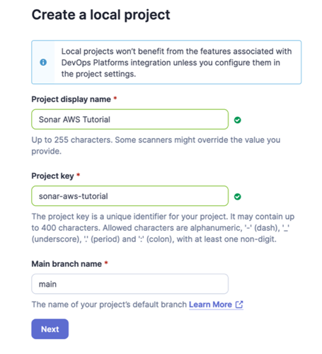

# Configure Sonarqube

After SonarQube has been successfully started with the previos step, it must be configured with two things:
1. a license
1. a project

## Setting SonarQube license
This workshop demonstrates several functionalities that are not provided with the [SonarQube Community Edition](https://www.sonarsource.com/open-source-editions/sonarqube-community-edition/) like branch and PR analysis, taint analysis etc.
The Developer Edition we deployed requires a license.
If you don't have one, please [reach out](https://www.sonarsource.com/plans-and-pricing/developer/) to obtain one (a Developer Edition 100k is sufficient for this tutorial).
As an alternative, you may run through the SonarQube deployment to learn about such deployment on EKS but use [SonarCloud](https://www.sonarsource.com/products/sonarcloud/), which is free for public projects. This tutorial does not cover SonarCloud use and the few needed changes for it.

1. Navigate to the SonarQube UI in your browser o nthe address you collected on the [previous step](../2.DeploySonarQube/README.md))

2. Use **Username**\:`admin` and **Password**\:`admin` to log in
3. Set a new password when prompted for it (don't forget this password!)
4. On the SonarQube UI, navigate to **Administration -> Configuration -> License Manager**
5. Enter the license key provided.

> ✨ If you are exploring these resources "offline" and would need a SonarQube evaluation license, request it from the SonarSource website [here](https://www.sonarsource.com/plans-and-pricing/)

## Creating the SonarQube project

A SonarQube *project* typically gathers the analysis results of a code repository (other setups are possible but not described in this workshop). Our sample Java application code is hosted on an AWS CodeCommit repository. Let's create the corresponding SonarQube project!

Projects can either be created from the SonarQube UI, or from their first analysis. We'll use the UI.
The project creation UI should open right after a license was set on the SonarQube instance:

Select a local project setup and fill in the following info:

* Project name: `Sonar AWS Tutorial`
* Project key: `sonar-aws-tutorial`
* Main branch name: `main`
* You may ignore the UI warning

When asked **What should be the baseline for new code for this project?** select `Use the global setting`.

Your SonarQube project is ready, waiting for the first pipeline analysis.

## Creating a Global Access Token
When SonarQube gets called by AWS CodeBuild to analyse your code, a *Global Access Token* is passed along for authentication. Follow these steps to create the token:

1. On the SonarQube UI, look for the **A** on your upper right hand side
1. On the dropdown menu that appears click **My Account**
1. Click **Security**
1. Enter a name for the token `globalanalysis`
1. Set type to `Global Analysis Token`
1. Click **Generate**
1. Copy the token and save it somewhere. You will need it later!